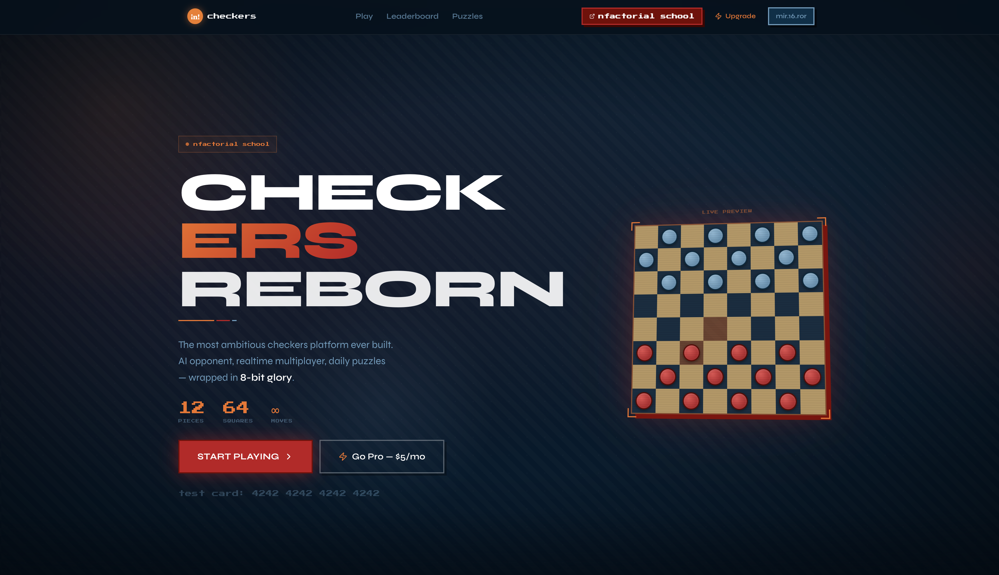
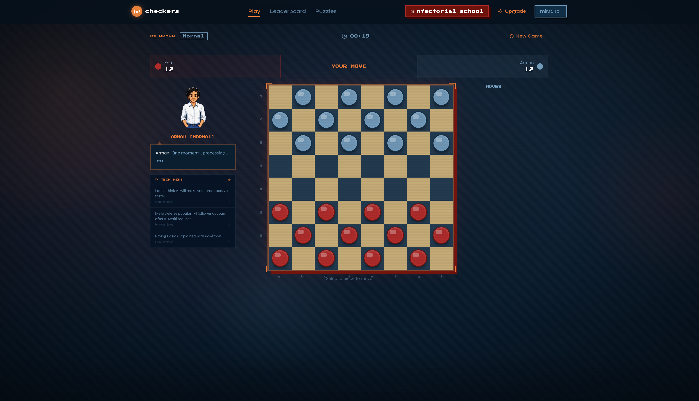
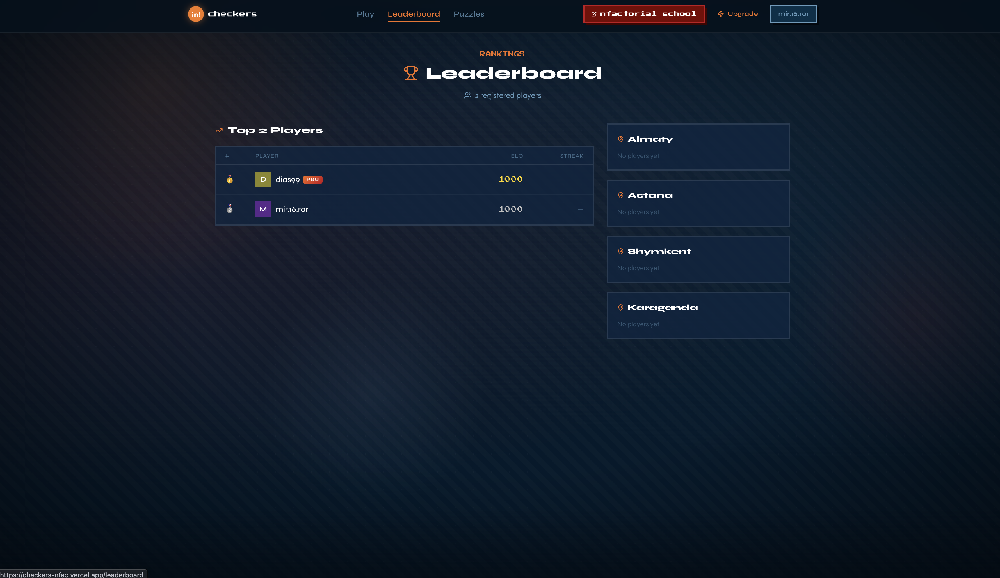
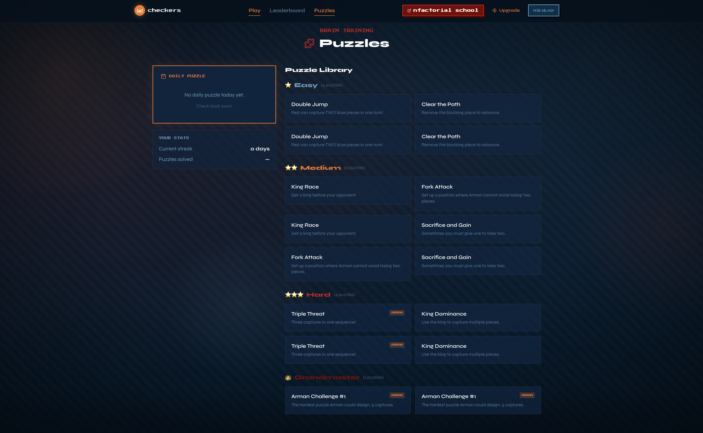
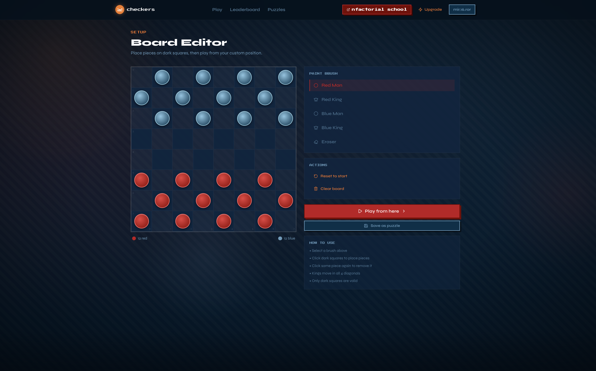
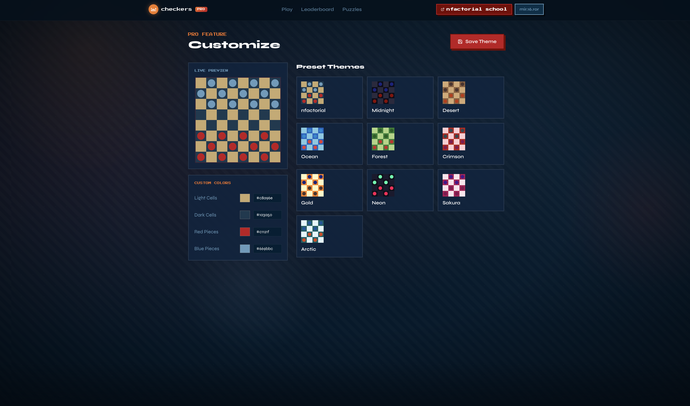

<div align="center">


<br />


<br />

[](https://checkers-nfac.vercel.app)

<br />


</div>

---

<!-- Once you record a GIF, uncomment this block and delete the line above it:
<div align="center">
  
</div>
-->

> **The most ambitious checkers platform ever built.** Not just a board game — a startup prototype with AI, real-time multiplayer, monetization, and pixel art soul. Built for the **nfactorial school 2024** challenge.

---

## Features

### 🤖 vs Arman AI
Battle an 8-bit pixel-art version of Arman Seitkali. Minimax + Alpha-Beta pruning at 3 difficulty levels. While Arman "thinks," he reads live **Hacker News** and shares summaries powered by **Gemini AI**. After the game — full AI Coach breakdown of your moves, in Arman's voice.

### ⚡ Real-time Multiplayer
Supabase WebSockets. Create a room → share the link → play instantly (no account required for guests). ELO matchmaking with city leaderboards: Almaty, Astana, Shymkent, Karaganda.

### 🧩 Puzzle Mode
50+ tactical studies from Easy to Grandmaster. Daily puzzle with streak tracking. Hint system (3 hints per puzzle, each costs points). Solution validation with from/to move checking.

### 💳 Pro Subscription ($5/mo)
Full Stripe integration. Subscribers unlock 10+ board themes, custom color picker, animated particle effects. Webhook → Supabase sets `is_pro = true`.

### 🎵 Audio System
Lo-fi background music via **Howler.js** + 8-bit SFX generated with **Web Audio API** — zero audio files. Piece clack, capture explosion, king jingle, victory fanfare.

### 💥 Animations
12-particle explosion on capture · Arman sprite with 5 states (idle/think/attack/celebrate/sad) · Spring-animated pieces · King crown burst · Staggered leaderboard entrances

---

## Screenshots

<!-- Save screenshots to public/screenshots/ then replace the placeholder text with:  etc. -->

| Landing | vs Arman AI | Leaderboard |
|:-------:|:-----------:|:-----------:|
|  |  |  |

| Puzzle Mode | Board Editor | Pro Themes |
|:-----------:|:-----------:|:----------:|
|  |  |  |

---

## Tech Stack

<div align="center">

| | | | | | | |
|:---:|:---:|:---:|:---:|:---:|:---:|:---:|
| <br/>Next.js 16 | <br/>TypeScript | <br/>Tailwind v4 | <br/>React 19 | <br/>Supabase | <br/>Vercel | <br/>PostgreSQL |

</div>

**Also:** Google Gemini 1.5 Flash · Stripe · Howler.js · Web Audio API · Framer Motion

---

## Design Philosophy

**nfactorial meets 8-bit.** Not a retro game, not a corporate dashboard. A startup product with pixel art soul.

- **UI pages** → clean, bold dark design (nfactorial DNA)
- **Game zone** → Press Start 2P font, CSS pixel sprite, particle explosions (8-bit DNA)
- **Palette:** `#003049` base · `#c1121f` red · `#f3701e` orange · `#669bbc` blue

---

## Why It's a Business

| Metric | Mechanism |
|--------|-----------|
| **Daily retention** | Daily puzzle + streak system |
| **Social hooks** | City ELO rankings ("I'm #3 in Almaty") |
| **Monetization** | $5/mo cosmetics subscription (impulse price) |
| **Virality** | Multiplayer invite link as primary growth loop |

---

<details>
<summary><b>🚀 Local Setup</b></summary>

```bash
npm install
cp .env.local.example .env.local
# fill in env values, then:
npm run dev
```

### Environment Variables

```env
NEXT_PUBLIC_SUPABASE_URL=
NEXT_PUBLIC_SUPABASE_ANON_KEY=
SUPABASE_SERVICE_ROLE_KEY=
GEMINI_API_KEY=
STRIPE_SECRET_KEY=sk_test_...
STRIPE_PUBLISHABLE_KEY=pk_test_...
STRIPE_WEBHOOK_SECRET=whsec_...
STRIPE_PRICE_ID=price_...
NEXT_PUBLIC_APP_URL=http://localhost:3000
```

Test Stripe with card `4242 4242 4242 4242` · any future expiry · any CVC.

</details>

<details>
<summary><b>📁 Project Structure</b></summary>

```
app/
  page.tsx                — Landing page
  play/
    ai/page.tsx           — vs Arman AI
    multiplayer/          — Online PvP + ELO matchmaking
    puzzle/               — Daily puzzle + library
    local/page.tsx        — Local 2-player
  leaderboard/            — Global + city ELO rankings
  subscribe/              — Pro subscription (Stripe)
  customize/              — Board theme editor (Pro only)
  editor/                 — Board position editor
  profile/                — User stats + game history
  api/
    ai-coach/             — Gemini post-game analysis
    arman-news/           — HackerNews + Gemini summaries
    stripe/               — Checkout + webhook

lib/checkers/
  engine.ts               — Full Russian checkers rules (pure TS)
  minimax.ts              — AI with Alpha-Beta pruning
  types.ts                — Game type definitions

components/game/
  Board.tsx               — Interactive game board
  ArmanSprite.tsx         — 8-bit CSS pixel art character
  ArmanPanel.tsx          — Arman speech + live news feed
  Explosion.tsx           — Particle explosion on capture
  GameOver.tsx            — End screen + AI Coach analysis
```

</details>

<details>
<summary><b>🗺 What I'd Build Next</b></summary>

- **Tournament system** — 8-player bracket with real-time spectating
- **Replay sharing** — Export any game as a shareable animated replay
- **Mobile PWA** — Install to home screen, offline puzzle mode
- **Neural network AI** — Trained on real checkers games, replacing Minimax
- **Social profiles** — Follow players, challenge friends directly

</details>

---

<div align="center">

**Made with ❤️ for nfactorial school 2024 · Built with [Claude Code](https://claude.ai/code)**

</div>
